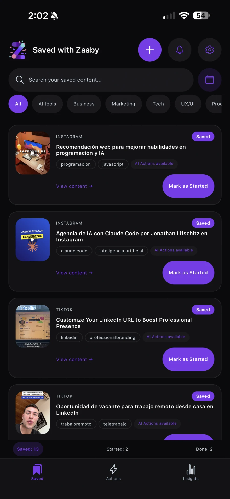
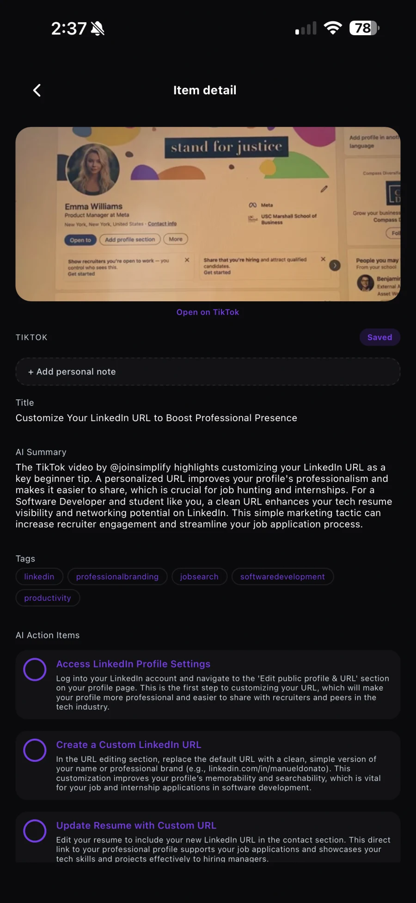
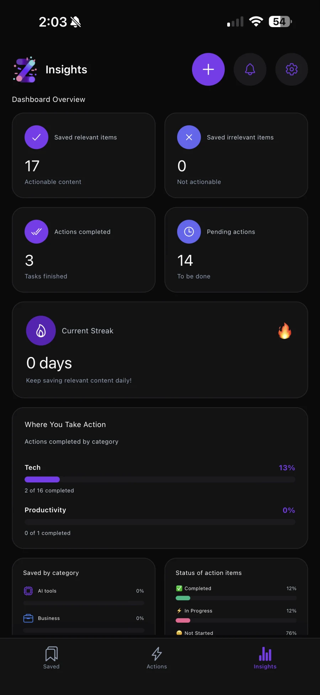
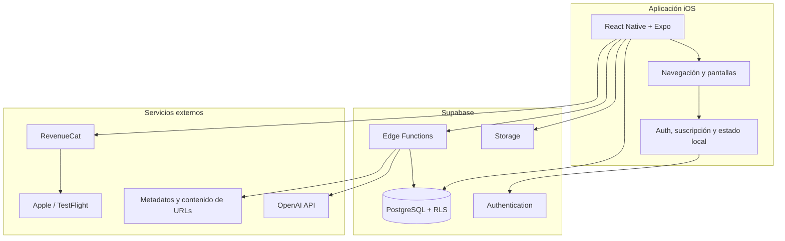

# Zaaby — Convierte contenido guardado en acciones

<p align="center">
  
  &nbsp;&nbsp;
  
  &nbsp;&nbsp;
  
</p>

<p align="center">
  <strong>Aplicación de productividad para iOS impulsada por inteligencia artificial.</strong><br />
  Guarda contenido, obtén resúmenes personalizados y conviértelo en acciones concretas.
</p>

<p align="center">
  <a href="https://zaaby.app">Sitio web</a>
  ·
  <a href="https://www.linkedin.com/in/manuel-donato-hernandez/">LinkedIn</a>
  ·
  <a href="https://donatohernandez.dev">Portafolio</a>
</p>

---

## Sobre este repositorio

Este repositorio documenta **Zaaby** como caso de estudio técnico y de producto. Su propósito es mostrar el problema que resuelve, la arquitectura utilizada, las principales decisiones de ingeniería y mi contribución como **cofundador y desarrollador principal**.

El código de producción se mantiene en un repositorio privado. Aquí no se incluyen credenciales, datos de usuarios, configuraciones sensibles ni propiedad intelectual interna.

## Resumen

Zaaby nace de un problema cotidiano: guardamos publicaciones, videos, artículos e ideas con la intención de volver a ellos, pero gran parte de ese contenido termina olvidado.

La aplicación convierte ese comportamiento pasivo en un flujo accionable:

1. El usuario guarda un enlace o una idea.
2. Zaaby recupera y normaliza la información disponible.
3. La IA genera un título, un resumen, etiquetas y acciones personalizadas.
4. El usuario ejecuta y completa esas acciones.
5. El panel de métricas muestra el progreso por estado y categoría.

El resultado es una experiencia que no se limita a almacenar contenido: ayuda al usuario a **entenderlo, organizarlo y aplicarlo**.

## El problema

Las herramientas tradicionales de marcadores son eficientes para guardar información, pero no para convertirla en conocimiento útil. Identificamos tres fricciones principales:

- El contenido queda distribuido entre distintas plataformas.
- Volver a leer o visualizar cada elemento requiere demasiado tiempo.
- No existe un siguiente paso claro que ayude a aplicar lo aprendido.

## La solución

Zaaby centraliza contenido guardado y utiliza IA para transformarlo en información estructurada y acciones concretas. Cada elemento puede incluir:

- Resumen generado según el contenido original.
- Etiquetas y categorías para facilitar la búsqueda.
- Acciones sugeridas con instrucciones claras.
- Estado automático: guardado, iniciado o completado.
- Notas personales, fecha objetivo y seguimiento de progreso.
- Métricas sobre contenido relevante y acciones completadas.

## Funcionalidades principales

| Funcionalidad | Descripción |
|---|---|
| **Procesamiento con IA** | Analiza enlaces e ideas para generar títulos, resúmenes, etiquetas y acciones sugeridas. |
| **Biblioteca centralizada** | Permite buscar y filtrar contenido por categoría, plataforma, estado y fecha. |
| **Acciones personalizadas** | Convierte cada contenido en pasos concretos que el usuario puede iniciar y completar. |
| **Flujo de progreso** | Actualiza el estado del contenido conforme avanzan sus acciones asociadas. |
| **Insights** | Presenta métricas de contenido guardado, acciones pendientes, avance y categorías. |
| **Autenticación** | Incluye acceso mediante correo, Google y Apple. |
| **Share Extension para iOS** | Permite enviar contenido a Zaaby desde otras aplicaciones mediante el menú Compartir. |
| **Notificaciones y recordatorios** | Ayuda a retomar contenido y mantener continuidad en las acciones. |
| **Suscripciones** | Gestiona acceso premium y compras dentro de la aplicación mediante RevenueCat. |
| **Administración de cuenta** | Incluye perfil, seguridad, sesiones activas y eliminación completa de la cuenta. |

## Mi rol

### Cofundador · Lead Full-Stack Developer

Lideré aproximadamente el **80 % del desarrollo técnico del producto**, desde la definición de la arquitectura hasta la distribución de versiones beta en TestFlight. Mi trabajo abarcó la aplicación móvil, el backend, la capa de datos, el procesamiento con IA, la seguridad y las integraciones externas.

### Aplicación móvil

- Construí la aplicación para iOS con React Native, Expo y TypeScript.
- Implementé la navegación, los flujos de autenticación y el onboarding.
- Desarrollé las vistas de biblioteca, detalle, acciones, métricas y configuración.
- Integré búsqueda, filtros, estados de progreso, notas y recordatorios.
- Implementé la Share Extension para guardar contenido directamente desde otras aplicaciones.
- Preparé builds y versiones beta mediante EAS Build y TestFlight.

### Backend y datos

- Diseñé el backend sobre Supabase y PostgreSQL.
- Modelé usuarios, perfiles, contenido guardado, acciones, eventos, notificaciones y uso de IA.
- Implementé Row Level Security para aislar los datos de cada usuario.
- Construí Edge Functions para procesamiento con IA, gestión de cuenta, sesiones y miniaturas.
- Configuré almacenamiento para recursos visuales y caché de contenido procesado.
- Añadí validaciones, límites de uso y trazabilidad de operaciones importantes.

### Inteligencia artificial

- Diseñé e implementé el flujo de procesamiento con OpenAI GPT-4.1-mini.
- Construí prompts estructurados para generar resúmenes, etiquetas y cinco acciones útiles.
- Incorporé información del perfil para personalizar los resultados según intereses y objetivos.
- Añadí detección de idioma y validación de la respuesta antes de guardarla.
- Implementé caché para evitar procesamiento repetido y reducir tiempo y costo.
- Registré llamadas, tokens y costos para facilitar el monitoreo del sistema.

### Producto, seguridad y operación

- Integré RevenueCat para suscripciones y acceso premium.
- Implementé autenticación social, recuperación de cuenta y administración de sesiones.
- Apliqué políticas de seguridad en base de datos y protegí las operaciones sensibles en servidor.
- Incorporé el flujo de eliminación de cuenta y datos requerido para distribución en iOS.
- Participé en pruebas funcionales, corrección de errores y mejoras de experiencia.
- Coordiné pruebas beta con **10 usuarios** mediante TestFlight.

## Flujo principal del producto

```mermaid
flowchart LR
    A[El usuario guarda un enlace o una idea] --> B[Zaaby obtiene y normaliza el contenido]
    B --> C[Edge Function valida usuario y solicitud]
    C --> D[OpenAI genera resumen, etiquetas y acciones]
    D --> E[Supabase almacena el resultado]
    E --> F[Biblioteca y detalle muestran el contenido]
    F --> G[El usuario completa acciones]
    G --> H[Insights actualiza métricas y progreso]
```



## Arquitectura



## Procesamiento de IA

El procesamiento ocurre en servidor para mantener las credenciales protegidas y controlar la lógica de negocio.

```text
Enlace o idea
    ↓
Validación de sesión y propiedad
    ↓
Obtención del contenido disponible
    ↓
Contexto del usuario + instrucciones estructuradas
    ↓
Generación con OpenAI
    ↓
Validación de idioma y estructura
    ↓
Persistencia de resumen, etiquetas y acciones
    ↓
Presentación y seguimiento en la aplicación
```

La respuesta se normaliza antes de almacenarse para conservar un contrato estable entre la IA, el backend y la interfaz móvil.

## Stack tecnológico

| Capa | Tecnologías |
|---|---|
| **Aplicación móvil** | React Native, Expo, TypeScript |
| **Navegación** | React Navigation |
| **Backend** | Supabase Edge Functions, Deno |
| **Base de datos** | PostgreSQL |
| **Autenticación** | Supabase Auth, Google Sign-In, Sign in with Apple |
| **Seguridad** | Row Level Security, JWT, validaciones en servidor |
| **Inteligencia artificial** | OpenAI API, GPT-4.1-mini |
| **Almacenamiento** | Supabase Storage |
| **Suscripciones** | RevenueCat, App Store |
| **Distribución** | EAS Build, TestFlight |
| **Integraciones de contenido** | oEmbed, metadatos Open Graph y servicios de extracción de URLs |

## Decisiones técnicas destacadas

### Procesamiento de IA en servidor

Las llamadas al modelo se realizan desde Edge Functions. Esto evita exponer credenciales en la aplicación y permite centralizar validaciones, límites, caché y monitoreo.

### PostgreSQL como fuente de verdad

El estado de cada elemento y sus acciones se almacena de manera centralizada. La interfaz deriva el progreso a partir de esos datos para conservar consistencia entre biblioteca, acciones e Insights.

### Seguridad por usuario con RLS

Las políticas de Row Level Security restringen el acceso a filas asociadas con el usuario autenticado. Las operaciones administrativas permanecen en funciones de servidor.

### Personalización contextual

El onboarding recopila intereses y objetivos que enriquecen el procesamiento. Esto permite que los resúmenes y las acciones propuestas respondan mejor al contexto de cada persona.

### Caché y control de costos

El contenido recuperado y ciertos resultados se reutilizan cuando es seguro hacerlo. También se registran eventos de uso de IA para medir consumo y detectar oportunidades de optimización.

### Integración nativa con iOS

La Share Extension reduce fricción: el usuario puede guardar contenido desde otra aplicación sin copiar y pegar manualmente el enlace dentro de Zaaby.

## Resultados tangibles

- Desarrollé aproximadamente el **80 % del producto**, desde la arquitectura hasta el despliegue beta.
- Construí un flujo completo que transforma contenido no estructurado en resúmenes, etiquetas y acciones consistentes.
- Integré frontend, backend, base de datos, autenticación, IA, suscripciones y distribución móvil.
- Implementé una beta funcional distribuida mediante TestFlight.
- Coordiné pruebas con **10 usuarios** para validar navegación, procesamiento, métricas y experiencia general.
- Centralicé el seguimiento mediante biblioteca, acciones e Insights en una sola experiencia.

## Retos y aprendizajes

### Convertir contenido heterogéneo en una salida consistente

Cada plataforma presenta información de forma distinta. La solución fue separar la obtención del contenido, la normalización y el procesamiento con IA para que la interfaz reciba siempre una estructura predecible.

### Equilibrar personalización, latencia y costo

Una respuesta más personalizada requiere contexto y validaciones adicionales. Diseñé el flujo para reutilizar contenido, limitar entradas y registrar consumo sin sacrificar la utilidad del resultado.

### Mantener sincronizado el progreso

Biblioteca, acciones e Insights dependen del mismo estado. Centralizar las reglas de progreso evitó que distintas pantallas interpretaran de manera diferente un elemento guardado.

### Preparar un producto móvil para distribución real

Además de desarrollar funcionalidades, fue necesario resolver autenticación social, compras, privacidad, eliminación de cuenta, builds firmados y pruebas en dispositivos reales.

## Estado del proyecto

Zaaby se encuentra como **MVP avanzado en TestFlight**. El producto cuenta con los flujos principales implementados y continúa en etapa de validación, optimización y preparación para su lanzamiento público.

Próximos objetivos:

- Continuar validando el producto con usuarios reales.
- Optimizar tiempos y costos del procesamiento con IA.
- Ampliar pruebas automatizadas y observabilidad.
- Refinar la experiencia con base en datos de uso.
- Preparar el lanzamiento público en App Store.

## Equipo

| Integrante | Rol | Enlaces |
|---|---|---|
| **Donato Hernández** | Cofundador · Lead Full-Stack Developer | [LinkedIn](https://www.linkedin.com/in/manuel-donato-hernandez/) · [GitHub](https://github.com/Donatohernandez) |
| **Gabriela Estrella** | Cofundadora · Arquitectura de Producto y Experiencia de IA | [LinkedIn](https://www.linkedin.com/in/gaby-estrella-/) · [GitHub](https://github.com/gabyestrella) |

## Contacto

Si deseas conocer más sobre la arquitectura, las decisiones técnicas o mi participación en Zaaby:

- **Portafolio:** [donatohernandez.dev](https://donatohernandez.dev)
- **LinkedIn:** [manuel-donato-hernandez](https://www.linkedin.com/in/manuel-donato-hernandez/)
- **GitHub:** [@Donatohernandez](https://github.com/Donatohernandez)
- **Correo:** [manueldonato9921@gmail.com](mailto:manueldonato9921@gmail.com)

---

<p align="center">
  <em>Repositorio creado con fines de portafolio. El código de producción de Zaaby es privado.</em><br />
  <strong>© 2026 Zaaby. Todos los derechos reservados.</strong>
</p>
